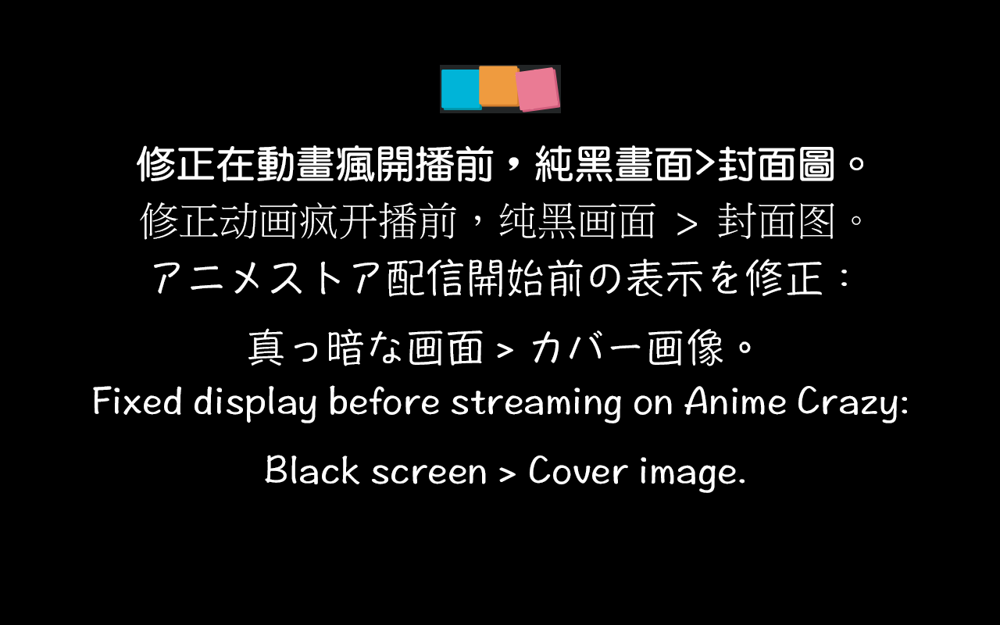

# [B.M] 動畫瘋 封面圖修正

[](https://developer.chrome.com/docs/extensions/mv3/)
[](https://ani.gamer.com.tw)
[](https://github.com/BoringMan314/bm-ani-gamer-cover-image-fix)
[](LICENSE)

適用於 [巴哈姆特動畫瘋](https://ani.gamer.com.tw)（`ani.gamer.com.tw`）的瀏覽器擴充功能：在影片播放頁將**開播前**播放器區域常見的**大面積純黑底**，改為以同一頁面所宣告之**封面圖**（以 `og:image` 等取得）作為**背景圖**；若 `<video>` 尚無 `poster` 屬性，一併補上，以減少全黑畫面。

*在巴哈姆特动画疯（`ani.gamer.com.tw`）视频页，将开播前黑底换为以封面图作为背景（取 og:image 等）。*<br>
*Bahamut Anime Crazy（`ani.gamer.com.tw`）の視聴ページで、再生前の黒一色の領域をカバー画像を背景にした表示に置き換えます。*<br>
*Replaces the black pre-play player area on Bahamut Anime Crazy (`ani.gamer.com.tw`) with the page cover image (e.g. og:image) as the background; sets the video `poster` when empty.*

> **聲明**：本專案為第三方輔助工具，與動畫瘋／巴哈姆特官方無關。使用請遵守該站服務條款與著作權規範。

---



---

## 目錄

- [功能](#功能)
- [系統需求](#系統需求)
- [安裝方式](#安裝方式)
- [本機開發與測試](#本機開發與測試)
- [技術概要](#技術概要)
- [專案結構](#專案結構)
- [版本與多語系](#版本與多語系)
- [隱私說明](#隱私說明)
- [維護者：更新 GitHub 與 Chrome 線上應用程式商店](#維護者更新-github-與-chrome-線上應用程式商店)
- [授權](#授權)
- [問題與建議](#問題與建議)

---

## 功能

- 從 `meta[property="og:image"]`、`og:image:secure_url` 或 `link[rel="image_src"]` 取得圖像網址，轉成絕對路徑後套用在 `.video-js` 容器之 `background-image`（`cover`／置中），取代播前**純黑**視覺（含分級提示等覆蓋層**背後**之區塊，實際可見與層疊關係依站臺當下 DOM 而定）。
- 若主影片元素尚無 `poster`，則一併設為同網址（站方已寫入 `poster` 時不覆寫）。
- 僅在 **`https://ani.gamer.com.tw/*`** 且符合影片頁條件時套用；`manifest` 未宣告 `host_permissions`。
- 若動畫瘋改版或缺少 `og:image`，可能不會有背景圖，需屆時再調整 [`content.js`](content.js) 之選取邏輯或來源。

---

## 系統需求

- **Chrome** 或 **Microsoft Edge**（Chromium）等支援 **Manifest V3** 的瀏覽器。

---

## 安裝方式

### 從 Chrome 線上應用程式商店（建議）

請在 [Chrome Web Store](https://chromewebstore.google.com/) 搜尋 **「[\[B.M\] 動畫瘋 封面圖修正](https://chromewebstore.google.com/detail/bm-%E5%8B%95%E7%95%AB%E7%98%8B-%E5%B0%81%E9%9D%A2%E5%9C%96%E4%BF%AE%E6%AD%A3/ldmdghahgfgfmfafaaeipndagpojkpif?hl=zh-TW)」**，或點擊名稱從商店頁面安裝。

### 從原始碼載入（開發人員模式）

1. 點選本頁綠色 **Code** → **Download ZIP** 解壓，或執行 `git clone https://github.com/BoringMan314/bm-ani-gamer-cover-image-fix.git` 複製本倉庫。
2. 以 **Chrome** 或 **Microsoft Edge** 開啟 `chrome://extensions`（在 Edge 為 `edge://extensions`）。
3. 開啟「**開發人員模式**」→「**載入未封裝項目**」→ 選取含 [`manifest.json`](manifest.json) 的**專案根目錄**（勿選子資料夾）。
4. 開啟動畫瘋任一有影片的頁面（如 `animeVideo.php?sn=…`），重新整理後觀察播放器週邊在播前是否以封面圖為底；變更 [`content.js`](content.js) 後請**重新載入**擴充再測。

---

## 本機開發與測試

修改 [`content.js`](content.js) 或 [`_locales/`](_locales/) 後，在 `chrome://extensions` 將本擴充**重新載入**，再重新整理動畫瘋分頁驗證。

---

## 技術概要

- **內容腳本** [`content.js`](content.js)：`document_idle` 注入；讀取頁面**既有**中繼與 `<video>`，以動態插入之 `<style>` 覆寫 `.video-js` 相關背景，並在條件符合時設 `video.poster`。
- **變化**：`MutationObserver` 監看 `body` 以應付播放器遲入或更換內容。

---

## 專案結構

| 路徑 | 說明 |
|------|------|
| [`manifest.json`](manifest.json) | Manifest V3 設定、內容腳本比對網址 |
| [`content.js`](content.js) | 讀取封面 URL、注入樣式與補 `poster` |
| [`_locales/`](_locales/) | 多語系字串（`zh_TW`、`zh_CN`、`ja_JP`、`en_US`） |
| [`privacy-policy.html`](privacy-policy.html) | 隱私權政策（上架商店所需之公開網頁） |
| [`icons/`](icons/) | 工具列與商店用圖示：icon.png |
| [`screenshot/`](screenshot/) | 商店與說明用截圖 |

---

## 版本與多語系

- **版本**：以 [`manifest.json`](manifest.json) 的 `version` 為準。
- **預設語系**：`zh_TW`（`default_locale`）。
- **內建語系**：`zh_TW`、`zh_CN`、`ja_JP`、`en_US`（路徑為 `_locales/<code>/messages.json`）。實際顯示依瀏覽器語系與遞減規則。

---

## 隱私說明

本擴充**不蒐集、不上傳**可識別個人之帳戶或瀏覽內容；**未內建**遠端可執行程式、分析或廣告追蹤。詳見 [`privacy-policy.html`](privacy-policy.html)。

**上架提醒**：若上架 Chrome Web Store，須在開發人員後台完成隱私實踐聲明，並提供本政策之**公開 HTTPS 網址**（建議以 [GitHub Pages](https://pages.github.com/) 託管專案內的 `privacy-policy.html`）。

---

## 維護者：更新 GitHub 與 Chrome 線上應用程式商店

### 更新至 GitHub

**Bash / Git Bash / PowerShell：**

```powershell
git add .
git commit -m "docs: 更新內容說明與商店連結"
git push origin main
```

### 更新至 Chrome 線上應用程式商店

請透過 [Chrome Web Store 開發人員控制台](https://chrome.google.com/webstore/devconsole) 手動上傳更新：

1. **遞增版本**：修改 `manifest.json` 中的 `version`（例如從 `0.1.0` 提升至 `0.1.1`）。
2. **封裝套件**：將專案內容壓縮為 ZIP 檔。
   - **必要檔案**：`manifest.json`, `content.js`, `privacy-policy.html`, `icons/`, `_locales/`
   - **建議不打包**：`.git/`, `.gitignore`, `README.md`, `screenshot/`, `*.psd`, `*.zip`, `*.url`
3. **上傳審核**：在控制台選擇項目 →「套件」→「上傳新套件」。
4. **提交送審**：確認版號、商店文案、截圖、隱私欄位與 `privacy-policy` 公開網址無誤後，點擊「**提交送審**」。

---

## 授權

本專案以 [MIT License](LICENSE) 授權。

---

## 問題與建議

歡迎透過 [GitHub Issues](https://github.com/BoringMan314/bm-ani-gamer-cover-image-fix/issues) 回報錯誤或提出改善建議。回報時請一併提供瀏覽器版本、**介面語言**及重現步驟。
